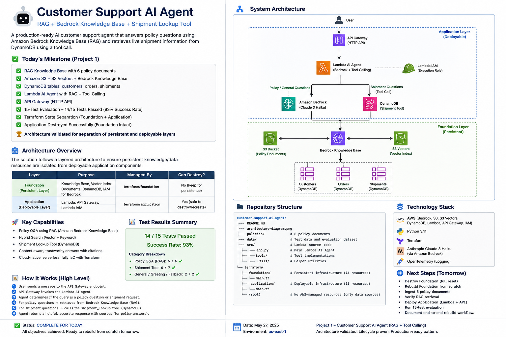

## 🏗️ Architecture

The Customer Support AI Agent follows a **two-layer architecture** that separates persistent knowledge/data infrastructure from the deployable AI application.



### Architecture Layers

| Layer | Components | Terraform State | Lifecycle |
|---|---|---|---|
| **Foundation – Persistent** | S3, S3 Vectors, Bedrock Knowledge Base, Data Source, DynamoDB, Bedrock IAM | `terraform/foundation` | Persistent |
| **Application – Deployable** | API Gateway, Lambda AI Agent, Lambda IAM, API integration, routes and permissions | `terraform/application` | Destroy / Recreate |

### Foundation Layer

The Foundation layer contains resources that preserve enterprise knowledge and business data:

- Amazon S3 — customer-support policy documents
- Amazon S3 Vectors — vector index
- Amazon Bedrock Knowledge Base — RAG retrieval
- Bedrock S3 data source
- DynamoDB Customers
- DynamoDB Orders
- DynamoDB Shipments
- IAM roles and policies required by Bedrock

The Foundation state is intentionally isolated so these resources can survive application deployments and teardown.

### Application Layer

The Application layer contains the deployable AI workload:

- Amazon API Gateway HTTP API
- AWS Lambda AI Agent
- Lambda execution role
- Bedrock model invocation permissions
- Knowledge Base retrieval permissions
- DynamoDB shipment lookup permissions
- API Gateway → Lambda integration
- `POST /chat` route
- Lambda invocation permission

### Request Flow

```text
Customer
   │
   ▼
API Gateway
   │
   ▼
Lambda AI Agent
   │
   ├── Policy / General Question
   │        │
   │        ▼
   │   Bedrock Knowledge Base
   │        │
   │        ├── S3 Policy Documents
   │        │
   │        └── S3 Vectors
   │
   └── Shipment Question
            │
            ▼
      get_shipment Tool
            │
            ▼
        DynamoDB
        Shipments